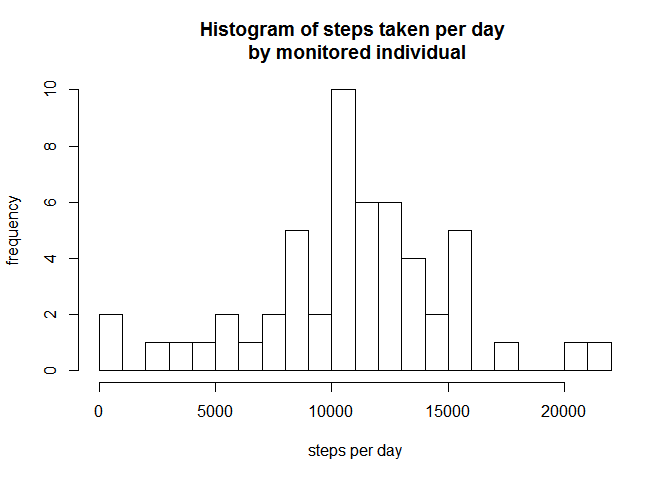
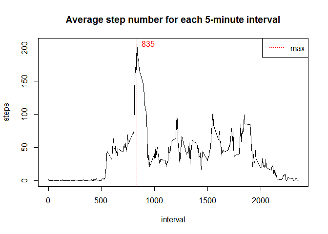
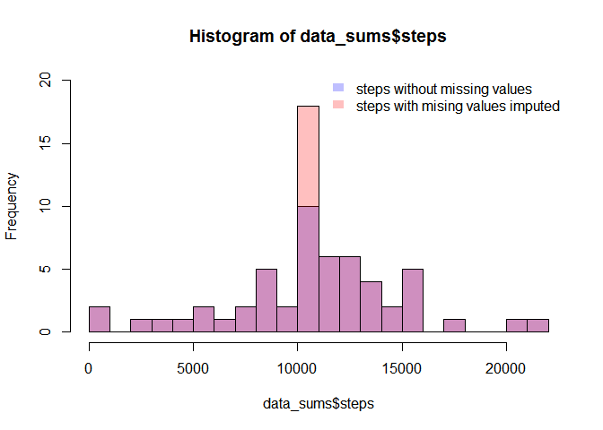
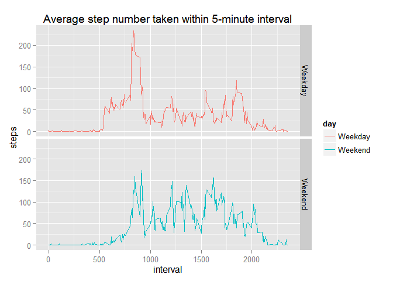

# Assignment1 RR course
Dorian  
Friday, March 06, 2015  


## Analysis and data manipulation  


####Loading and preprocessing the data 
**Activity monitoring data** was loaded from [this link]([https://d396qusza40orc.cloudfront.net/repdata%2Fdata%2Factivity.zip) and extracted to the working directory.


```r
data <- read.csv("activity.csv", header = TRUE, colClasses = c("integer", "Date", "integer"))
head(data)
```

```
##   steps       date interval
## 1    NA 2012-10-01        0
## 2    NA 2012-10-01        5
## 3    NA 2012-10-01       10
## 4    NA 2012-10-01       15
## 5    NA 2012-10-01       20
## 6    NA 2012-10-01       25
```

#### What is mean total number of steps taken per day?

Aggregate data to calculate sum of steps per day and print a histogram.


```r
data_sums <- aggregate(data = data, steps ~ date, sum)
hist(data_sums$steps, breaks = 20, xlab = "steps per day", ylab = "frequency", main = "Histogram of steps taken per day \n by monitored individual")
```

 

Make a summary of steps taken per day, that includes median and mean.

```r
summary(data_sums$steps)
```

```
##    Min. 1st Qu.  Median    Mean 3rd Qu.    Max. 
##      41    8841   10760   10770   13290   21190
```

####What is the average daily activity pattern?  
Agregate data by interval and calculate mean step value  

```r
data_average_interval <- aggregate(data = data, steps ~ interval, mean, na.rm = TRUE)
head(data_average_interval)
```

```
##   interval     steps
## 1        0 1.7169811
## 2        5 0.3396226
## 3       10 0.1320755
## 4       15 0.1509434
## 5       20 0.0754717
## 6       25 2.0943396
```
Plot average number of steps for each interval and calculate interval with the highest average numer of steps.


```r
max_steps <- data_average_interval[data_average_interval$steps == max(data_average_interval$steps),]
plot(data_average_interval, type = "l", main = "Average step number for each 5-minute interval")
abline(v = max_steps[[1]], lty = 3, col = "red")
text(x = max_steps[[1]], y = max_steps[[2]], labels = as.character(max_steps[[1]]), pos = 4, col = "red")
legend("topright", lty = 3, "max", col = "red")
```

 

####Imputing missing values
Calculate how many days/intervals are missing step values.

```r
sum(is.na(data$steps))
```

```
## [1] 2304
```

There is a value of mean step number for **each** interval. Therefore this mean value can be used to fill the NA values. Following function *imput_values()* returns step value or mean of step values for each interval for each day using created earlier *data_average_interval* data.frame.  


```r
impute_value <- function(data, refdata){
    value <- c()
    for (i in 1:nrow(data)){
        if (is.na(data[i,1])){
            new_value <- round(refdata[refdata[1] == data[i,3], 2])
            value <- c(value, new_value)
        }else{
            value <- c(value, data[i,1])
        }
    }
    return(value)
}

data$imp_steps <- impute_value(data, data_average_interval)

data_imp_sums <- aggregate(data = data, imp_steps ~ date, sum)
```
The change in mean and median for data with NAs:

```r
summary(data_sums$steps, digits = 5)
```

```
##    Min. 1st Qu.  Median    Mean 3rd Qu.    Max. 
##      41    8841   10765   10766   13294   21194
```
and data with NAs substituted with intervale average values:

```r
summary(data_imp_sums$imp_steps, digits = 5)
```

```
##    Min. 1st Qu.  Median    Mean 3rd Qu.    Max. 
##      41    9819   10762   10766   12811   21194
```


```r
h1 <- hist(data_sums$steps, breaks = 20, plot = FALSE)
h2 <- hist(data_imp_sums$imp_steps, breaks = 20, plot = FALSE)

plot( h1, col=rgb(0,0,1,1/4), ylim = c(0,20))
plot( h2, col=rgb(1,0,0,1/4), ylim = c(0,20) ,add=T)

legend('topright',c('steps without missing values','steps with mising values imputed'),
       fill = c(rgb(0,0,1,1/4), rgb(1,0,0,1/4)), bty = 'n',
       border = NA)
```

 
**Answer:** Mean as not changed, since we have used it to impute missing values. Median is shifted toward average steps value of newly added data.    

####Are there differences in activity patterns between weekdays and weekends?  
  
Changing sys date settings Englih (for language reasons).
Adding new variable distinguishing weekdays from weekends

```r
Sys.setlocale("LC_TIME", "English")
```

```
## [1] "English_United States.1252"
```

```r
data$day <- as.factor(ifelse(weekdays(data$date) %in% c("Saturday","Sunday"), "Weekend", "Weekday"))
```
And aggregating data by interval and weekday

```r
data_week <- aggregate(data = data, steps ~ day + interval, mean)
```
Plot the results using ggplot from ggplot2 package

```r
library(ggplot2)

plot1 <- ggplot(data_week, aes(interval, steps)) +  geom_line(aes(col = day)) + ggtitle("Average step number taken within 5-minute interval") + facet_grid(day~.)
plot1
```

 
